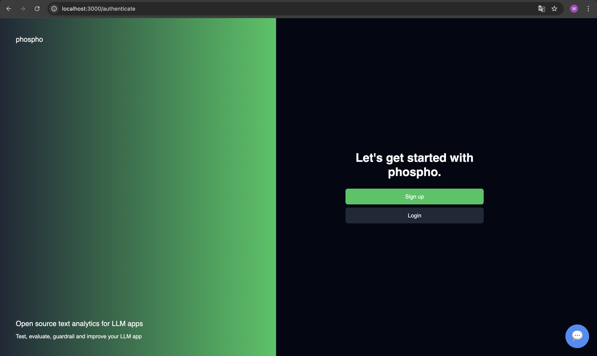
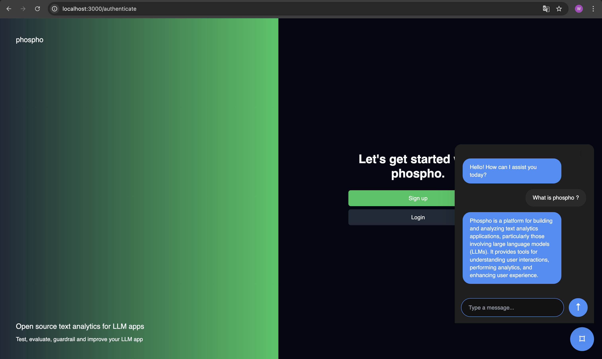

# Deploy in your website a custom chat assistant

This repository implements an assistant chatbot that proceed RAG on a custom website.

**How it works ?**

The assistant gets information from an url you gave, store the embeddings in a vector database and use a LLM to generate answers.

## Result

Here is an example where the url given to the assistant is *https://doc.phospho.ai*.





## Set up

After cloning the repository, create a `.env` file in the root of the repository. Then put the following informations in your `.env`.

```python
URL="https://www.example.com"

MISTRAL_API_KEY="your_mistral_api_key"
ORIGINS=["http://localhost:3000"]
DOMAIN_STATUS_FILE="domain_status.json"
PHOSPHO_API_KEY="your_phospho_api_key"
PHOSPHO_PROJECT_ID="you_phospho_project_id"
```

In `URL` put the url you want the assistant to know about.
The assistant will crawl domains with a depth of 3 (this is customizable).

_Keep the `DOMAIN_STATUS_FILE` as it is._

### MISTRAL

The assistant needs an LLM to generate an answer. Here, a Mistral ai model is used - _mistral-large-latest_, so you need a `MISTRAL_API_KEY`. You can [obtain one here](https://mistral.ai).

###

The assistant logs the messages in **phospho**. Obtain your `PHOSPHO_API_KEY` and your `PHOSPHO_PROJECT_ID` [here](https://platform.phospho.ai).

## Run the assistant

This repository contains a **docker-compose.yml** file, you can run the assistant using
this

```bash
cd clone_repo_path
docker-compose up --build
```

## Communicate to the assistant

Now you can send questions to the assistant using the POST API endpoint `/question_on_url`. It will return streamable response. If you want to call it from an other virtual machine, add it to the `ORIGINS`list in your `.env`.

Example:

```
ORIGINS = ["http://localhost:3000", "http://localhost:3001"]
```

_Only urls in `ORIGINS` can access the `/question_on_url` endpoint._

## Integrate it in your site

You can easily add an assistant interface by adding

```
<script src="http://localhost:8080/component/chat-bubble.js" async />
```

in a HTML component.

## Customize the ports and the interface (Optional)

### Ports

The docker runs the main app on port _8080_.
In order to change it, add a `SERVER_URL` field in your `.env`.

```
SERVER_URL=your_new_port
```

Then change the source of the interface script: `<script src="your_new_port/component/chat-bubble.js" async />`

### Interface

The file `component/chat-bubble.js` is served as a static file and is the compiled version of the `interface/chat-bubble.js`. To change it, modify the `interface/chat-bubble.js` and then run `npx webpack` in the folder _app_ of the repo.
